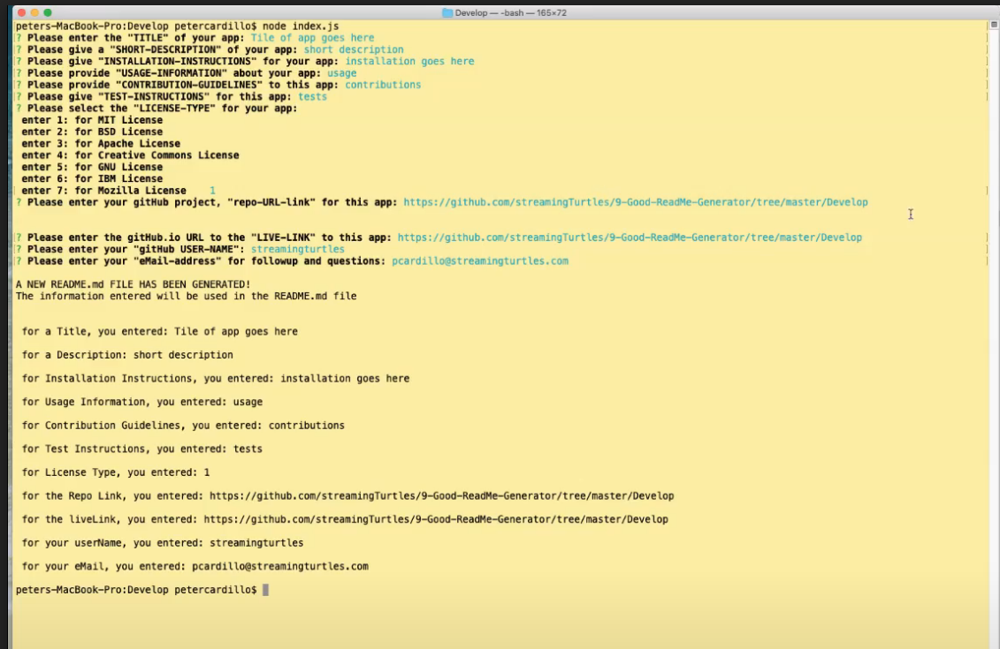

  # Project Title: HW #9 Good ReadMe.md File Generator
    
  ## Table of Contents:
  - [Project Description](#Project-Description:)
  - [Installation Instructions](#Installation-Instructions:)
  - [Project Usage Information](#Project-Usage-Information:)
  - [Contribution Guidelines](#Contribution-Guidelines:)
  - [Testing Instructions](#Testing-Instructions:)
  - [License Type](#License-Type:)
  - [gitHub Repo Link](#gitHub-Repo-Link:)
  - [gitHub Live Web Link](#gitHub-Live-Web-Link:)
  - [gitHub Informaton](#gitHub-Information:)
  - [my eMail](#my-eMail-for-Questions-&-Information:)
  - [Video Demp of this App](https://drive.google.com/file/d/1Kyv42J8LFpPHozBL9SpcvEG-AiruLC4h/view)
  - Screenshot of README App Generator creating file:
  
  

  &nbsp;
  - - -
  ## Project Description:
  - This app will generate a file named README.md, which captures the users inputs to a series of questions that address the several sections describing your application.

  &nbsp;
  - - -
  ## Installation Instructions:
  - to begin the app that generates the file, run from the command line the following command >node index.js

  &nbsp;
  - - -
  ## Project Usage Information:
  - This app is to be used to create a README.md file for your gitHub app.

  &nbsp;
  - - -
  ## Contribution Guidelines:
  - I made this, PAC with Streaming Turtles, LLC

  &nbsp;
  - - -
  ## Testing Instructions:
  - Gather your application details and the licence type your interested in attaching to your project, and when you are prompted, please enter in those details accordinly.  If you don't choose a licence, the README.md file will show: "NO LICENSE HAS BEEN SELECTED"

  &nbsp;
  - - -
  ## License Type:
  - 

  &nbsp;
  - - -
  ## gitHub Repo Link:
  - https://github.com/streamingTurtles/9-Good-ReadMe-Generator/tree/master/Develop

  &nbsp;
  - - -
  ## gitHub Live Web Link:
  - https://streamingturtles.github.io/9-Good-ReadMe-Generator/index.html

  &nbsp;
  - - -
  ## gitHub Information:

  
- user name: streamingturtles
- [GitHub Profile](https://github.com/streamingTurtles)

  ## my eMail for Questions & Information:
  - pcardillo@streamingTurtles.com  

  &nbsp;
- - -
- - -
Peter Cardillo, Columbia Engineering Fullstack Bootcamp, 2020-2021  
